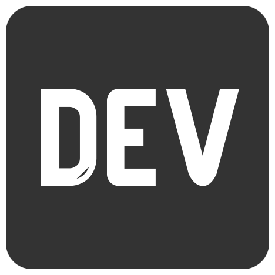

<h3 align="center">👋 Hi, I'm Omar.</h3>

  CS Student. Full-Stack Web Developer. iOS Developer.

  
  &nbsp;
  
  &nbsp;
  
  &nbsp;
  

I am a Computer Science graduate from Carnegie Mellon University. I enjoy developing websites and creating apps. Currently, I am experimenting with Go and SwiftUI. You can check out my blog posts <a href="https://dev.to/oohsinan">here</a>, I write about web and app development in general. I'm mostly active on Twitter, so reach me at <a href="https://twitter.com/oohsinan/">@oohsinan</a> 😄

<!--
**omarsinan/omarsinan** is a ✨ _special_ ✨ repository because its `README.md` (this file) appears on your GitHub profile.

Here are some ideas to get you started:

- 🔭 I’m currently working on ...
- 🌱 I’m currently learning ...
- 👯 I’m looking to collaborate on ...
- 🤔 I’m looking for help with ...
- 💬 Ask me about ...
- 📫 How to reach me: ...
- 😄 Pronouns: ...
- ⚡ Fun fact: ...
-->
